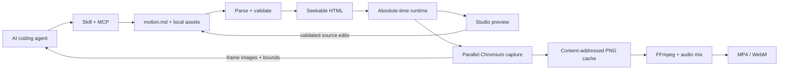

# Motioon architecture

The normalized composition is the shared boundary. Both scene syntaxes produce
canvas metadata, declared assets, audio tracks and timed scenes. Structured
scenes contain semantic elements; HTML scenes contain an authored fragment.
Neither the Studio nor the MCP server maintains a second video document model.

The compiler emits the same runtime for Studio and export. Studio scales its
iframe externally; export uses the native viewport. Each frame is derived from
absolute time, so workers can seek independently. CSS animations are paused and
sought in scene-local time. Custom JavaScript participates through `onFrame`.

The renderer starts an ephemeral loopback server containing a fixed composition
snapshot and local files, waits for images/fonts, then captures requested frame
indices. A conservative cache identity includes runtime, source, browser version
and project files. Workers write complete PNGs through temporary files. Encoding
reads them in order with stream backpressure. Temporary video output is renamed
only after successful encoding, preserving existing exports on failure.

Studio API writes validate the full resulting composition and require the source
revision read by the editor. Patches replace only the selected YAML scene fence;
full source saves preserve exactly the submitted text. Atomic replacement avoids
partially written documents. Concurrent external editors are detected through
revision hashes; there is no collaboration protocol or automatic merge.

The MCP server uses SDK-managed stdio transport, schemas and tool result types.
It delegates to the same project, inspection and rendering functions as the CLI.
Frame tools return image blocks a vision-capable agent can actually examine.
Studio preview servers opened by MCP are closed with that MCP server.

The supplied prototype directories are retained outside the maintained package
layout. Production modules and tests live at the root. `npm pack` includes only
the runtime product, examples, skill and format documentation.
