# Direction
Recreation of the supplied 83-0.mp4 Cosmos promo. Preserve the square canvas,
warm white, restrained black typography, contextual pills, photo cuts, phone
zoom and closing wordmark. Photos, interface crops and audio are extracted from
the supplied reference. Typography, placement, transitions and scrolling are
authored in HTML and seekable JavaScript. This is a close reconstruction, not a
pixel-identical restoration; cropped source imagery retains source compression.

## Scene: cosmos (0s-20.04s)

  
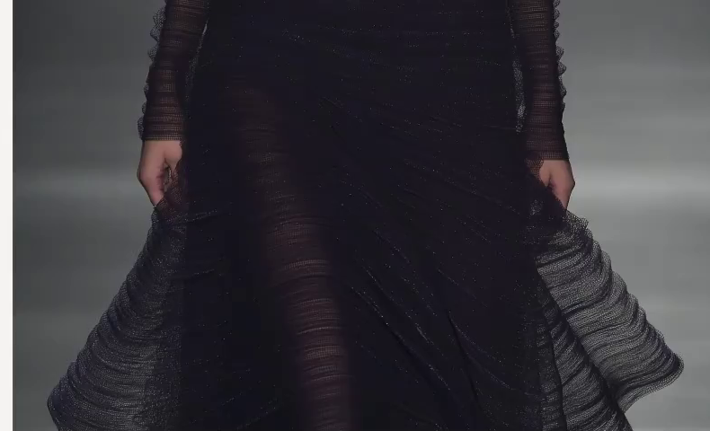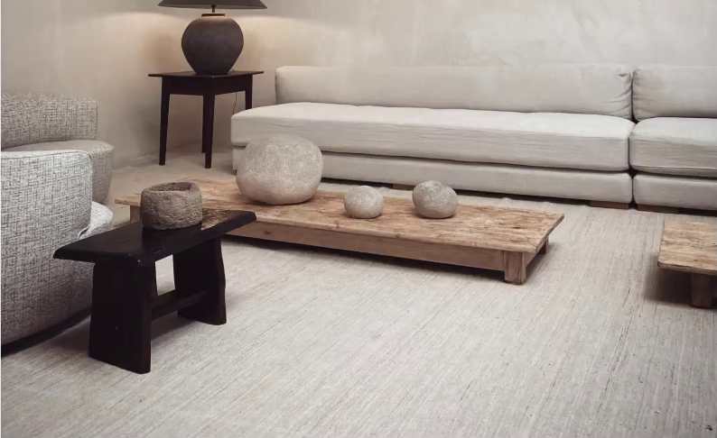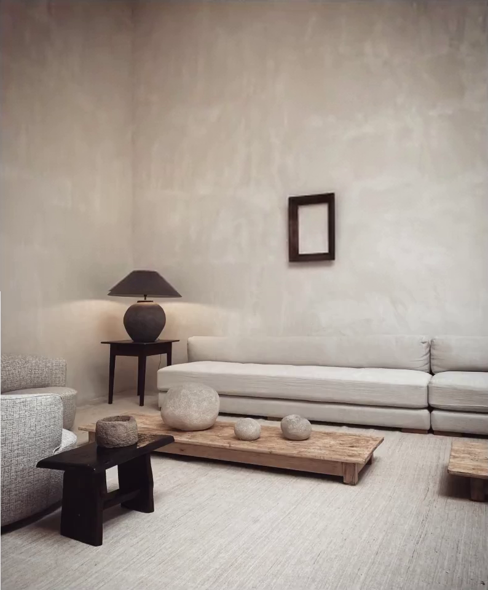

  
<svg id="opening" viewBox="0 0 1080 1080" data-motion="opening" aria-label="What if we had more context?">
    <text id="introWhat">What</text><text id="introIf">if</text><text id="introWe">we</text><text id="introHad">had</text>
    <g id="introContext"><rect x="-15" y="-54" width="324" height="72" rx="27" fill="#fcfbf8" stroke="#deddd9" stroke-width="1.5"/><text>more context</text></g><text id="introQuestion">?</text>
  </svg>

  

    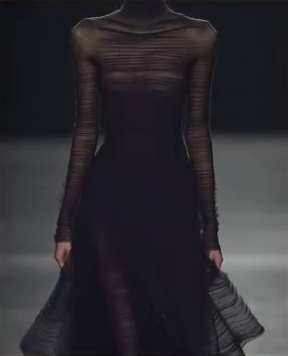
    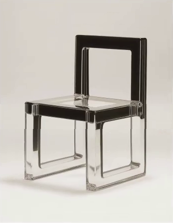
    
    
YearLocationObjectBrand

  

  
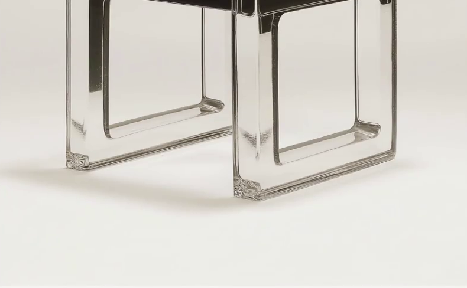

<b>↥</b><b>+</b><b>···</b>

  
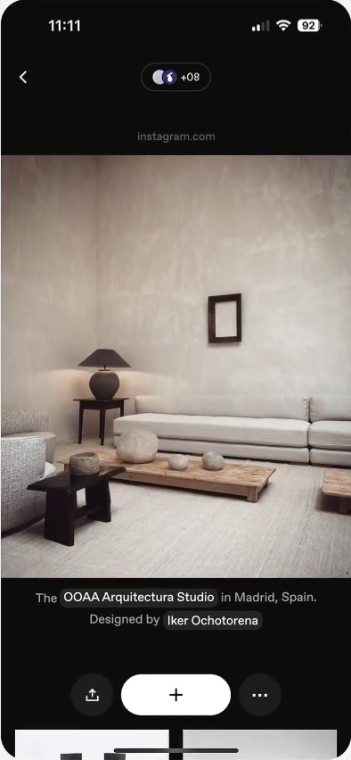

  

    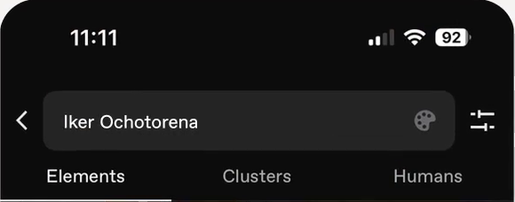
    

    

      

        
        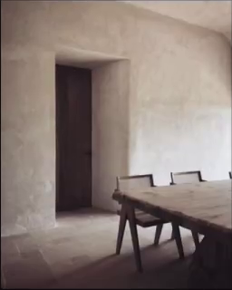
        
        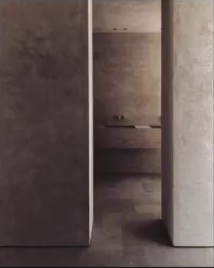
        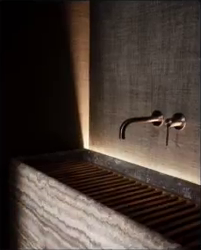
        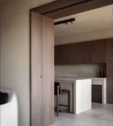
      

      

        
        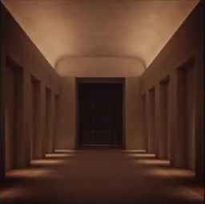
        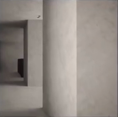
        
        
        
        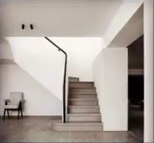
      

    

    
  

  

  

